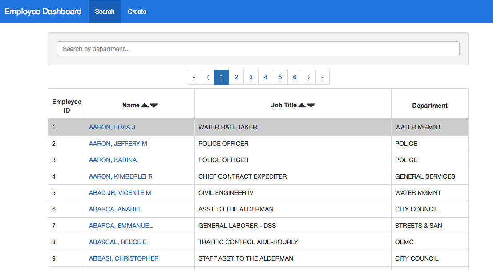
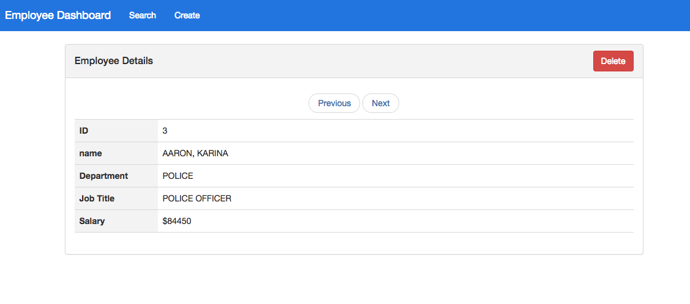
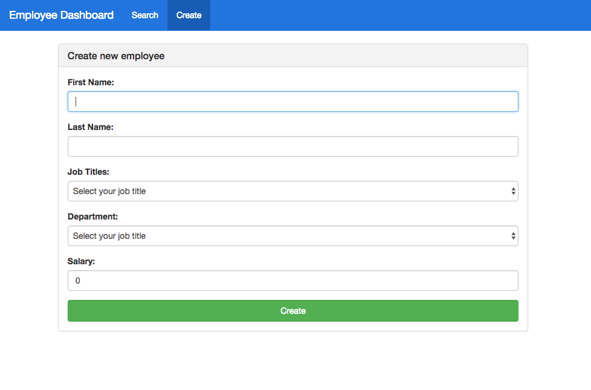

# React fullstack app - Employee Dashboard

- Client: **React.js**
- Server: **Node/Express.js**
- Database: **MongoDB**

## Live Demo:

https://react-redux-employee-app.herokuapp.com/

## Front-end features

- Pagination
- Filter
- Form
- Keyboard _Down_, _Up_ and _Enter_ key is avaiable to move employee list.

## RESTful API

**List employees**

<table style="font-size:13px">
  <tr>
    <td style="background:#fafafa; font-weight: bold">HTTP Method</td>
    <td>GET</td>
  </tr>
  <tr>
    <td style="background:#fafafa; font-weight: bold">URL</td>
    <td>https://powerful-springs-20093.herokuapp.com/api/employees</td>
  </tr>
  <tr>
    <td style="background:#fafafa; font-weight: bold">Query Parameters</td>
    <td>
      <ul>
        <li>page=1</li>
        <li>The default page number is 100 records per page.</li>
      </ul>
    </td>
  </tr>
  <tr>
    <td style="background:#fafafa; font-weight: bold">Responses</td>
    <td>
      
200 OK

      
500 Server encountered an error
    
    </td>
  </tr>     
</table>

**Get a single employees**

<table style="font-size:13px">
  <tr>
    <td style="background:#fafafa; font-weight: bold">HTTP Method</td>
    <td>GET</td>
  </tr>
  <tr>
    <td style="background:#fafafa; font-weight: bold">URL</td>
    <td>https://powerful-springs-20093.herokuapp.com/api/employees/10</td>
  </tr>
  <tr>
    <td style="background:#fafafa; font-weight: bold">Path Parameters</td>
    <td>
        employee's id
    </td>
  </tr>
  <tr>
    <td style="background:#fafafa; font-weight: bold">Responses</td>
    <td>
      
200 OK

      
404 Employee was not found
    
      
500 Server encountered an error
    
    </td>
  </tr>     
</table>

**Create a new employee**

<table style="font-size:13px">
  <tr>
    <td style="background:#fafafa; font-weight: bold">HTTP Method</td>
    <td>POST</td>
  </tr>
  <tr>
    <td style="background:#fafafa; font-weight: bold">URL</td>
    <td>https://powerful-springs-20093.herokuapp.com/api/employees</td>
  </tr>
  <tr>
    <td style="background:#fafafa; font-weight: bold">REQUEST BODY</td>
    <td>
        <ul>
          <li>name</li>
          <li>department</li>
          <li>employee_annual_salary</li>
          <li>job_title</li>
        </ul>
    </td>
  </tr>
  <tr>
    <td style="background:#fafafa; font-weight: bold">Responses</td>
    <td>
      
200 OK

      
500 Server encountered an error
    
    </td>
  </tr>     
</table>

**Delete an employee**

<table style="font-size:13px">
  <tr>
    <td style="background:#fafafa; font-weight: bold">HTTP Method</td>
    <td>DELETE</td>
  </tr>
  <tr>
    <td style="background:#fafafa; font-weight: bold">URL</td>
    <td>https://powerful-springs-20093.herokuapp.com/api/employees/20</td>
  </tr>
  <tr>
    <td style="background:#fafafa; font-weight: bold">Path parameters</td>
    <td>
      Employee's id
    </td>
  </tr>
  <tr>
    <td style="background:#fafafa; font-weight: bold">Responses</td>
    <td>
      
200 OK

      
500 Server encountered an error
    
    </td>
  </tr>     
</table>

## Screenshot

[3/13/2020]

## Can Heroku force an application to use SSL/TLS?

ToDo

1. Set up sub domain to cheap-domain-registration ==> test.hirokoymj.com - Done.
2. Set up Heroku app to a custom domain ==> Done
3. Try force SSL ==>

## References:

- [Can Heroku force an application to use SSL/TLS?](https://help.heroku.com/J2R1S4T8/can-heroku-force-an-application-to-use-ssl-tls)
- https://jaketrent.com/post/https-redirect-node-heroku/
- https://stackoverflow.com/questions/7185074/heroku-nodejs-http-to-https-ssl-forced-redirect
- https://stackoverflow.com/questions/11104028/process-env-node-env-is-undefined

test